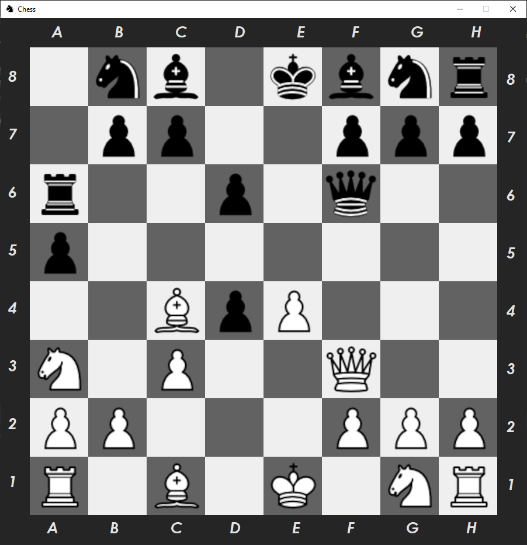
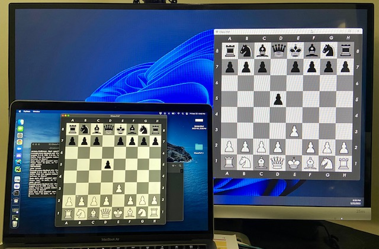

Chess PvP (v2) || Beaverhacks Spring 2022
==============================
Updated October 2022

Chess built with Pygame, which can either be played alone or between two computers.  Internet access required.

Getting Started - Mac or Linux
------------

<ul>
<li>Clone this repo to your machine <code>git clone https://github.com/ljensen505/ChessPvP.git</code></li>
<li>Navigate to the newly created directory <code>cd ChessPvP</code></li>
<li>create a virtual environment <code>python3 -m venv venv</code></li>
<li>activate the environment <code>source venv/bin/activate</code></li>
<li>Install dependencies <code>pip install -r requirements.txt</code></li>
<li>Start the game <code>python main.py</code></li>
</ul>

The project contains several files, which are described as follows:
- `main.py` The main file for playing the game
- `server.py` This is not a server, but is used to communicate with the RESTish API  
- `pieces.py` Various classes for each Chess piece
- `board.py`  A class for creating the board. Only used for backend testing.
- `/assets` A collection of images that are used to render the game window 

Cool features!
------------
- The game window can be resized! Aspect ratios of the window and all assets are maintained. This has been great for playing on computers with different monitor sizes.
- You can play a game of Chess exclusively in the terminal, if you so choose. Just run `chess.py` instead, with no command line arguments
- Game data persists via pickling. Even if only playing on one computer, you can exit the game and resume it later
- This communicates with a RESTish API which is hosted in my living room: http://api.chess.lucasjensen.me also: https://github.com/ljensen505/ChessAPI

Known issues
------------
- The game logic is incomplete. A few more complex moves, such an en passant and castling, have not been implemented
- There is no visual prompt in the game window for Check, though a message is printed in the terminal
- There is no prompt whatsoever for checkmate, though the game does lock up
- There is no enforcement of who moves which piece (just like the real world!)
- Due to speed limitations of the RESTish API server, lag is common and can be frustrating

Chess in action
------------

<a href="https://www.youtube.com/watch?v=y30Trim7Tio&ab_channel=LucasJensen">Demo on YouTube (v1)</a>

    

--------

<small>Project built solely by Lucas Jensen for <a href="https://beaverhacks-spring-2022.devpost.com/">BeaverHacks Spring 2022: Gamify</a></small>
