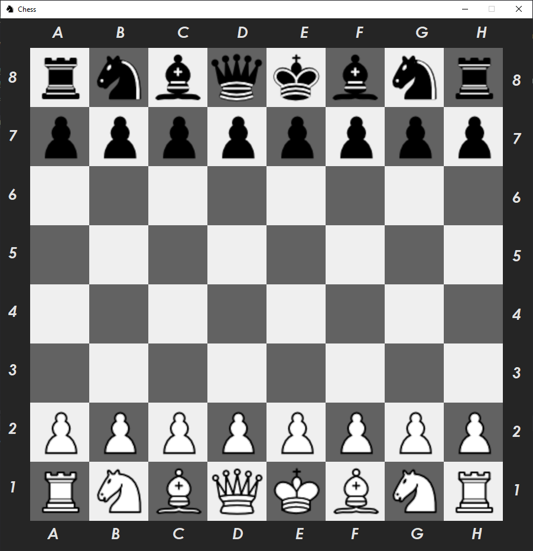

Chess PvP || Beaverhacks Spring 2022
==============================

Chess built with Pygame, which can either be played alone or between two computers over the same network.  This project 
was built with Python and Pygame

Getting Started
------------
- Clone this repo to your machine.  
- Create a virtual environment in the main directory  
`python3 -m venv venv` or with your preferred method.  Followed by: 
`activate your venv`  
`pip install -r requirements.txt`  

The project contains several files, which are described as follows:
- `main.py` The main file for playing the game
- `server.py` A very simple server which allows the pickle file to be shared over the local network  
- `pieces.py` Various classes for each Chess piece
- `board.py`  A class for creating the board. Only used for backend testing.
- `/assets` A collection of images that are used to render the game window 

To run the game
------------

To play a game of Chess on a single computer:

From the project directory, run `python game.py host`  

Depending on your OS, you may need to use `python3` instead. This will launch the game and show a few helpful tips, which are as follows
- Press `esc` or close the window to quit the game
- Press `c` to clear the game and start anew.
- Your server will start automatically, though a 2nd person joining is not necessary.

To join the game
------------

From the 2nd computer, connect to the same network as the host, run:

`python game.py player2`

Including `host` or `player2` as a command line argument when starting the program is a requirement.

 Players should decide amongst themselves who will be which color. Just like a real game of Chess, there is no mechanism
in place to prevent a player from touching the other players pieces, or to prevent a third person from coming by and messing things up. 
 We are all adults here.

Cool features!
------------
- The game window can be resized! Aspect ratios of the window and all assets are maintained. This has been great for playing on computers with different monitor sizes.
- You can play a game of Chess exclusively in the terminal, if you so choose. Just run `chess.py` instead, with no command line arguments
- Game data persists via pickling. Even if only playing on one computer, you can exit the game and resume it later

Known issues
------------
- The game logic is incomplete. A few more complex moves, such an en passant and castling, have not been implemented
- There is no visual prompt in the game window for Check, though a message is printed in the terminal
- There is no prompt whatsoever for checkmate, though the game does lock up
- The way this is served locally is very specific to my setup. This app is not flexible and will not other machines without significant modification. As such, I'd like to re-write it at some point to use CRUD operations and a real database.

Chess in action
------------

<a href="https://www.youtube.com/watch?v=y30Trim7Tio&ab_channel=LucasJensen">Demo on YouTube</a>

    

--------

<small>Project built solely by Lucas Jensen for <a href="https://beaverhacks-spring-2022.devpost.com/">BeaverHacks Spring 2022: Gamify</a></small>
